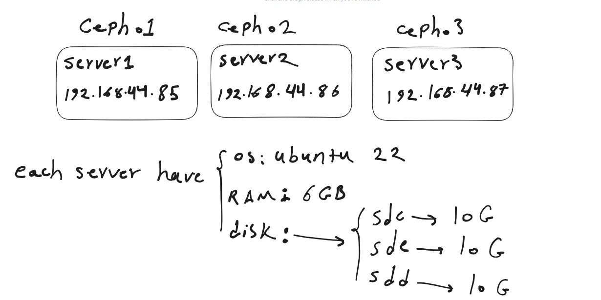

# Ceph
Ceph is an open-source software-defined storage platform designed to provide highly scalable and fault-tolerant storage solutions. It is commonly used in data centers and cloud environments to manage and store vast amounts of data efficiently. Ceph offers a distributed storage system that can be used for a variety of storage needs, including object storage, block storage, and file storage.

Key components of Ceph include:

1. **RADOS (Reliable Autonomic Distributed Object Store)**: This is the underlying object storage system in Ceph. It manages the distribution, replication, and fault tolerance of data across a cluster of storage nodes.

2. **RADOS Gateway (RGW)**: RGW is an object storage gateway that provides a RESTful interface to interact with Ceph's object storage. It enables users to access Ceph storage using protocols like Amazon S3 and Swift.

3. **RBD (RADOS Block Device)**: RBD allows you to create block devices that can be mounted and used like traditional storage volumes. It's often used with virtualization platforms like KVM and Xen.

4. **Ceph File System (CephFS)**: CephFS is a distributed file system built on top of Ceph, providing a POSIX-compliant file system that can be mounted on clients.

Ceph's distributed architecture and data redundancy mechanisms make it highly resilient to hardware failures, and its ability to scale horizontally allows it to accommodate growing storage needs. It's a popular choice for organizations that require scalable, reliable, and cost-effective storage solutions for large datasets and applications.

# Installation
[ref](https://docs.ceph.com/en/latest/cephadm/install/#cephadm-deploying-new-cluster)



```
# run on all nodes
sudo apt install cephadm

# run on ceph01
sudo cephadm bootstrap --mon-ip 192.168.44.85 --initial-dashboard-user admin --initial-dashboard-password test


# after installation you can use shell
cephadm shell
ceph --version
ceph -s
exit


```


# add hosts
be sure, you have to logout from `cephadm shell` before running below command

go to the ssh config of `ceph02` and `ceph03` and enable root login
```
vim /etc/ssh/sshd_config

PermitRootLogin yes


```

now copy ssh-copy-id 

```
ssh-copy-id -f -i /etc/ceph/ceph.pub root@192.168.44.86
ssh-copy-id -f -i /etc/ceph/ceph.pub root@192.168.44.87


```

now go to the `cephadm shell`

```
cephadm shell
ceph orch host add ceph02 192.168.44.86
ceph orch host add ceph02 192.168.44.87
ceph orch host ls

ceph -s   # get ceph host

ceph orch host label add ceph02 _admin
ceph orch host label add ceph03 _admin


ceph orch ps
ceph orch ls

```


### adding OSD

```
ceph orch apply osd --all-available-devices --dry-run
ceph orch apply osd --all-available-devices
ceph orch status
ceph orch ls
ceph orch ps
ceph -s
ceph osd tree


ceph pg ls
ceph osd pool ls detail


```


# Create pool

```
ceph osd pool create block-device-pool-test
ceph osd pool ls detail
ceph health detail
rbd pool init block-device-pool-test
ceph osd pool ls detail
rbd create --size 10G --pool block-device-pool-test vol1-test
rbd ls --pool block-device-pool-test -l


# create user for client access
ceph auth add client.test mon 'allow r' osd 'allow rwx pool=block-device-pool-test'
ceph auth get client.test

# generate a config file for user to connect to ceph:
ceph config generate-minimal-conf

# copy the output of above command and store in `/etc/ceph/ceph.conf` in client machine.

-----------
ceph auth get client.test

# copy the output of above command and store in `/etc/ceph/ceph.keyring` in client machine.


# clinet
# use pool on client side, go to the client and install required libraries

apt search ceph-common
sudo apt install ceph-common

lsmod | grep rbd
modprobe rbd

for permenent load , add in the below file
vim /etc/modules


rbd -c /etc/ceph/ceph.conf -k /etc/ceph/ceph.keyring -n client.test ls --pool block-device-pool-test -l

rbd -n client.test ls --pool block-device-pool-test -l

rbd -n client.test device map --pool block-device-pool-test vol1-test
lsblk

create a partion with fdisk on this device, and write file-system.

finally mount this partions
mount /dev/rbd0p1 /mnt/
df -TH

dd if=/dev/random of=/mnt/file bs=100M count=30

```